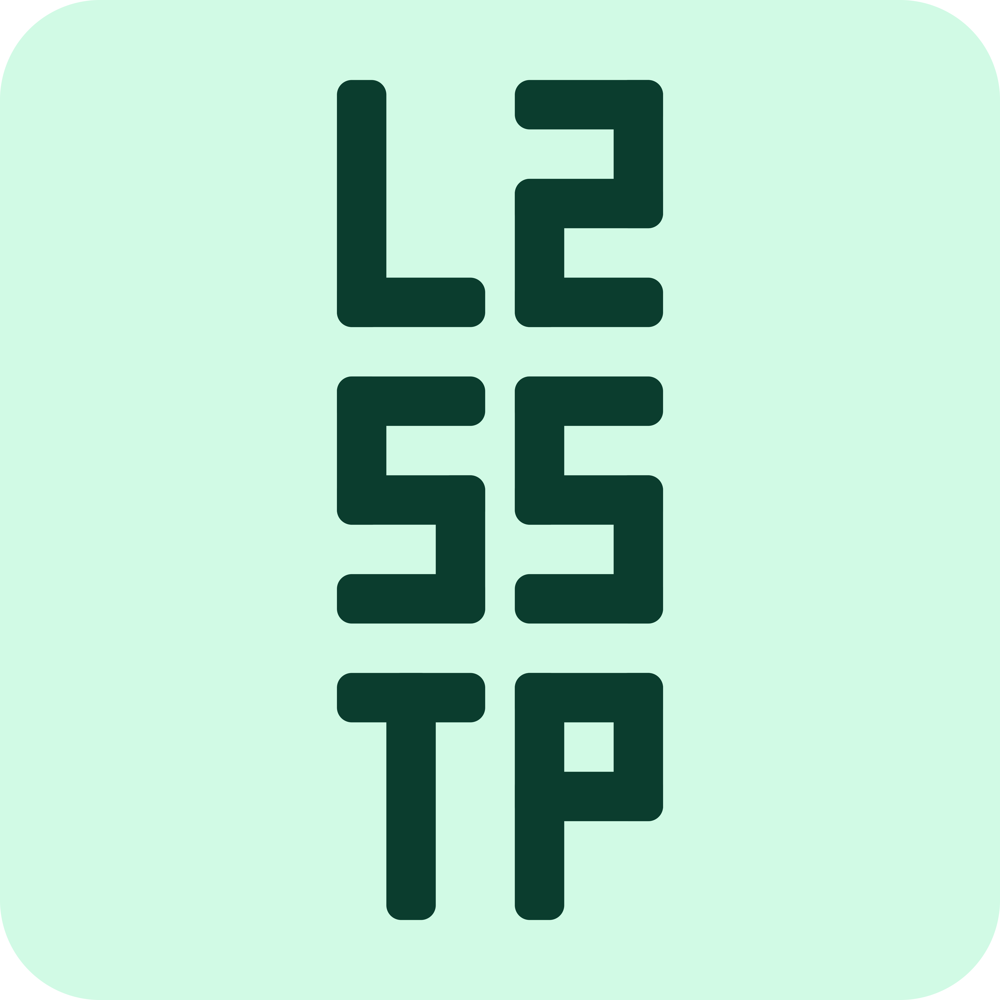

> A fork of [TunnelForge](https://github.com/evokelektrique/tunnel-forge) (GPL-3.0)
> with an SSTP engine derived from [Open SSTP Client](https://github.com/kittoku/Open-SSTP-Client) (MIT).
> This is an independent project and is not affiliated with or endorsed by
> the authors of either upstream project.
>
> [Русская версия](README.ru.md) • [SPEC](SPEC) • [Architecture](docs/ARCHITECTURE.md) • [Licensing](docs/LICENSING.md)

<p align="center">
  
</p>

<h1 align="center">L2/SS/TP</h1>

<p align="center">
  L2TP/IPsec (IKEv1) and SSTP for modern Android, with a server certificate
  store, failover groups, and per-app routing.
</p>

<p align="center">
  <a href="https://github.com/Mr1ve3r/l2tp-sstp-client/actions/workflows/ci.yml" style="text-decoration: none;">
    
  </a>
  <a href="https://github.com/Mr1ve3r/l2tp-sstp-client/actions/workflows/codeql.yml" style="text-decoration: none;">
    
  </a>
  <a href="https://github.com/Mr1ve3r/l2tp-sstp-client/releases/latest" style="text-decoration: none;">
    
  </a>
  <a href="https://github.com/Mr1ve3r/l2tp-sstp-client/releases" style="text-decoration: none;">
    
  </a>
  <a href="https://github.com/Mr1ve3r/l2tp-sstp-client/blob/main/LICENSE" style="text-decoration: none;">
    
  </a>
</p>


<p align="center">
  <a href="#overview">Overview</a> •
  <a href="#screenshots">Screenshots</a> •
  <a href="#install">Install</a> •
  <a href="#development">Development</a> •
  <a href="#architecture--project-layout">Architecture</a> •
  <a href="#security--privacy">Security</a> •
  <a href="#debugging">Debugging</a> •
  <a href="#contributing">Contributing</a> •
  <a href="#feedback">Feedback</a> •
  <a href="#licensing">Licensing</a>
</p>

## Fork status

This fork adds an SSTP engine alongside the existing L2TP/IPsec one, behind a
protocol selector in the profile, with a tunnel layer and a server-certificate
store shared by both. Work follows the phased plan in [`SPEC`](SPEC):

- [x] Phase 1 — module layout, version catalog, ktlint, CI
- [x] Phase 2 — `engine-api` contract
- [x] Phase 3 — `core-tunnel`
- [x] Phase 4 — `engine-l2tp`
- [x] Phase 5 — `core-trust`
- [x] Phase 6 — `engine-sstp`
- [x] Phase 7 — single `VpnService` and protocol dispatcher
- [x] Phase 8 — profile model, storage, migration
- [x] Phase 9 — UI
- [x] Phase 10 — failover ([auto-selection by network was dropped](docs/PHASE10.md))
- [x] Phase 11 — tests, documentation, release

Everything below this section describes the L2TP client inherited from
upstream, and still applies; what the fork adds is listed under
[SSTP and certificates](#sstp-and-certificates). What is done and what is
deliberately not done is recorded in [`CHANGELOG.md`](CHANGELOG.md) and, phase
by phase, in appendix В of the [`SPEC`](SPEC).

## Overview

Android 12 removed the old built-in L2TP and PPTP VPN options. A lot of offices, schools, universities, and private networks still have L2TP/IPsec servers in place.

L2/SS/TP is an Android client for those setups. It connects to existing L2TP/IPsec (IKEv1) servers, so you can keep using the server you already have while running a current Android version. It also speaks SSTP over TLS on port 443, for the networks where UDP/500 and ESP are filtered and L2TP cannot get out at all.

### Key features

- L2TP with optional IPsec (IKEv1) client flow
- Full-device VPN mode
- Proxy-only mode with local HTTP and SOCKS5 listeners
- Per-app routing (Inclusive and Exclusive)
- Multiple profiles with credential storage
- Connection status and detailed logs
- Custom DNS supporting UDP, TCP, TLS and HTTPS
- Variable MTU

### SSTP and certificates

What this fork adds on top of the above:

- SSTP over TLS on port 443, with PAP, CHAP, MSCHAPv2 and EAP-MSCHAPv2
- SSTP through an HTTP proxy, with or without proxy authentication
- A server certificate store with five trust policies — `SYSTEM`,
  `SYSTEM_PLUS_CUSTOM`, `CUSTOM_ONLY`, `STORE_AUTO`, `PIN_LEAF`, and `INSECURE`
  in debug builds only
- `STORE_AUTO` for the common case: import your server's certificate authority
  and connect, without also having to pick it out of a list. The chain is built
  by searching, so a server that omits an intermediate or sends an extra
  certificate still resolves. The trade is that any certificate you have
  imported may vouch for any profile using this mode, so the app tells you how
  many that is and logs which one actually did
- Fingerprint pinning, an `expectedHostname` field for certificates issued to a
  name the server is not reached by, and a pre-flight check that says what a
  profile will accept before it connects
- Failover groups: an ordered list of profiles tried in turn, stopping on an
  authentication failure rather than walking the list with a wrong password
- A Quick Settings tile, per-protocol log filtering, and Russian localisation

## Screenshots

<table>
  <tr>
    <td align="center" width="33%">
      
    </td>
    <td align="center" width="33%">
      
    </td>
    <td align="center" width="33%">
      
    </td>
  </tr>
</table>

## Install

### GitHub Releases

Download the APK for your ABI from
[GitHub Releases](https://github.com/Mr1ve3r/l2tp-sstp-client/releases/latest),
and check it against the published `SHA256SUMS` before installing.

### F-Droid

Not published yet. The metadata is prepared in
[`docs/fdroid/`](docs/fdroid/) and the merge request to `fdroiddata` is still to
be filed.

> This fork has its own application id, `io.github.mr1ve3r.l2tpsstp`, and its
> own signing key. It installs alongside upstream TunnelForge rather than over
> it, and one cannot update the other.

> L2/SS/TP is only the client; you still need access to a compatible
L2TP/IPsec or SSTP server.

## Development

### Requirements

- Flutter with Dart `3.11+`
- Go `1.25.9+` for the Android gVisor userspace networking module
- Android SDK configured for Flutter Android builds
- Android NDK and CMake, installed through Android Studio or `sdkmanager`
- Android `minSdk 31` or newer for the app target

### Setup

```sh
flutter pub get
cd android/gvisor
go mod download
cd ../..
```

Run the app on a connected Android device or emulator:

```sh
flutter run
```

### Common Workflows

The Makefile wraps the commands used during normal development:

```sh
make format
make check
make test
make build-debug
```

- `make format` formats Dart and Android native C sources.
- `make check` runs Flutter analysis, Android lint, and native C checks.
- `make test` runs Flutter, Android unit, and native C tests.
- `make build-debug` builds the Android debug APK.

For focused targets, run:

```sh
make help
```

### Coverage

```sh
flutter test --coverage
```

`core-trust` holds the trust policies, so it has a floor rather than a report:
CI fails below 80% of instructions. Reproduce it with

```sh
cd android && ./gradlew :core-trust:jacocoCoverageVerification
```

What is measured and what is deliberately left out is explained in
`core-trust/build.gradle.kts` and in [`docs/PHASE11.md`](docs/PHASE11.md).

### Local VPN Server

The included [docker-compose.yml](docker-compose.yml) starts a local
`hwdsl2/ipsec-vpn-server` setup for Linux hosts.

1. Copy [.env.example](.env.example) to `.env`.
2. Set `VPN_PUBLIC_IP` to the address your Android client can reach.
3. Configure `VPN_IPSEC_PSK`, `VPN_USER`, and `VPN_PASSWORD`.
4. Create a matching profile in the app.

Start the server:

```sh
docker compose up -d
```

The VPN container reads only the `VPN_*` values from the root `.env`.

## Architecture & Project Layout

L2/SS/TP is a Flutter app at the UI layer, but the VPN runtime is mostly Android-native. Flutter keeps the profile, settings, logs, and connection state, then talks to Kotlin through platform channels. Kotlin owns the Android `VpnService` and foreground service lifecycle, runs the Netty-based HTTP CONNECT/SOCKS5 proxy frontend, and hands tunnel work to native code. The C layer handles L2TP/IPsec and packet processing; proxy-only mode also uses a small Go/gVisor userspace networking module, built as a native shared library and loaded by the Android runtime.

Netty is the local proxy frontend. It accepts HTTP CONNECT and SOCKS5 clients with event-loop based I/O, while blocking tunnel transport work stays behind that frontend. The C engine remains the core L2TP/IPsec path, and Go/gVisor provides the userspace TCP/IP stack used by proxy-only mode.

| Path | Purpose |
| --- | --- |
| `lib/` | Flutter UI, profiles, settings, logs, and app state |
| `android/app/src/main/kotlin/` | Android VPN service, Netty proxy runtime, and platform channels |
| `android/app/src/main/cpp/` | Native L2TP/IPsec tunnel engine and packet handling |
| `android/gvisor/` | Go/gVisor userspace networking used by proxy mode |
| `fastlane/metadata/` | Store metadata, screenshots, and changelogs |
| `tool/` | Release, versioning, and VPN diagnostic scripts |
| `engine-api/` | Protocol-agnostic engine contract: `VpnEngine`, `EngineProfile`, `EngineError` |
| `engine-l2tp/` | `VpnEngine` wrapper around the native L2TP/IPsec engine |
| `engine-sstp/` | SSTP engine derived from Open SSTP Client |
| `core-tunnel/` | Shared TUN, routing and DNS layer |
| `core-trust/` | Server certificate store and trust policies |
| `third_party/open-sstp-client/` | Upstream MIT licence and per-file provenance |
| `docs/` | Architecture, licensing, and dependency notes |

## Security & Privacy

- VPN credentials, IPsec pre-shared keys and proxy passwords are encrypted with
  an AES-GCM key held in the Android Keystore. They are not in the profile
  database, and profile export omits them unless an encrypted container is
  asked for.
- Imported server certificates are copied into internal storage rather than
  referenced by `Uri`, so an always-on tunnel can read them before the device
  is unlocked.
- Debug logs stay local, and sensitive tokens are redacted before display or sharing.
- No analytics or crash-reporting SDKs are included in this repo.
- Review debug logs before sharing them in public issues.

## Debugging

General diagnostics:

```sh
sh tool/vpn_debug.sh check
sh tool/vpn_debug.sh diag --iface wlo1 --client-ip 192.168.1.100
sh tool/vpn_debug.sh capture --iface wlo1
sh tool/vpn_debug.sh log --iface wlo1
```

Libreswan and container logs:

```sh
sh tool/vpn_debug.sh pluto-logs --container ipsec-vpn-server
docker exec -it ipsec-vpn-server tail -f /var/log/auth.log
```

## Contributing

- [`CONTRIBUTING.md`](CONTRIBUTING.md) — build, the gates CI runs, and what a
  change to this codebase is expected to come with
- [`CODE_OF_CONDUCT.md`](CODE_OF_CONDUCT.md)
- [`SECURITY.md`](SECURITY.md) — **do not report a security problem in a public
  issue**
- [`CHANGELOG.md`](CHANGELOG.md)
- [`docs/TEST_MATRIX.md`](docs/TEST_MATRIX.md) — the manual pass a release needs

## Feedback

Use GitHub Issues for bugs, feature requests or general feedback. When
reporting a connection problem, include the values used in the profile (such as
MTU and DNS), Android version, device model, and app logs (debug). Review a log
export before posting it publicly.

Upstream TunnelForge has its own Telegram channel. It is not a support channel
for this fork — problems that only exist here should not land there.

## Licensing

This project is licensed under `GPL-3.0-or-later`. It combines GPL-3.0 code from
TunnelForge with MIT code from Open SSTP Client; the combination must be GPL-3.0.

- [`LICENSE`](LICENSE) — full GPL-3.0 text
- [`NOTICE`](NOTICE) — upstream projects and their licences
- [`third_party/open-sstp-client/LICENSE`](third_party/open-sstp-client/LICENSE) — verbatim MIT text
- [`third_party/open-sstp-client/PROVENANCE.md`](third_party/open-sstp-client/PROVENANCE.md) — per-file origin of imported code
- [`docs/LICENSING.md`](docs/LICENSING.md) — why GPL-3.0, and what a fork of this fork must do
